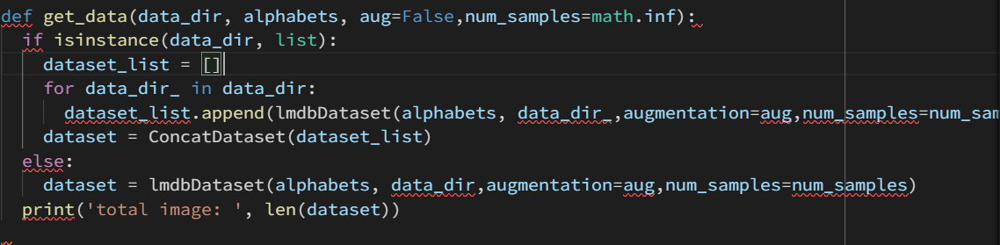
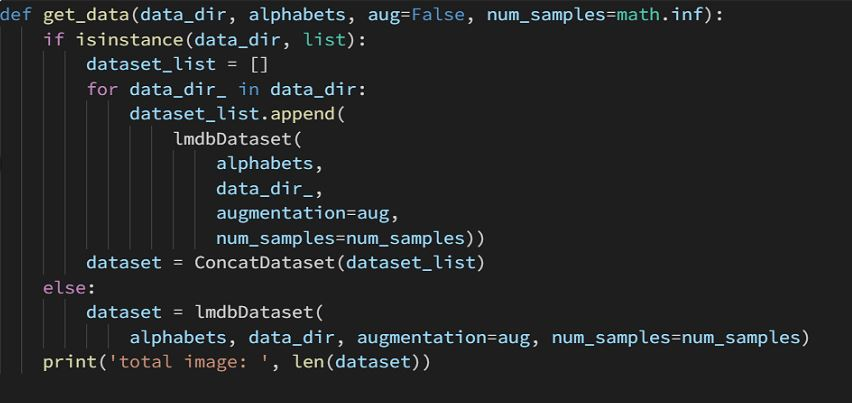
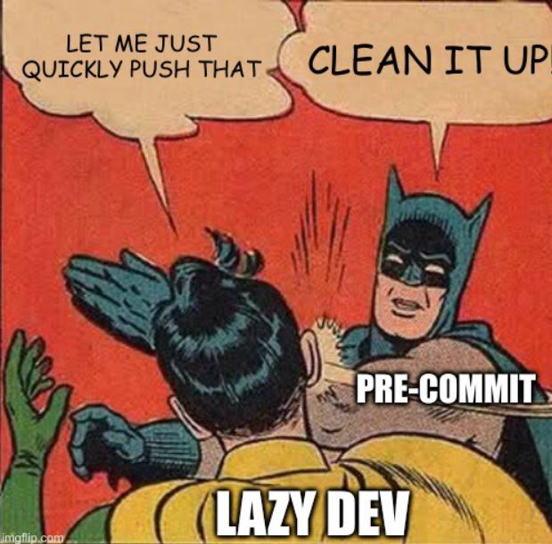
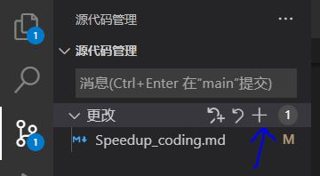

# High-Efficiency Coding Strategy

- [High-Efficiency Coding Strategy](#high-efficiency-coding-strategy)
  - [1. You shouldn't miss VSCode](#1-you-shouldnt-miss-vscode)
  - [2. Automatically format your code](#2-automatically-format-your-code)
  - [3. Use a pre-commit hook to check your code](#3-use-a-pre-commit-hook-to-check-your-code)
  - [4. Learn to use Git](#4-learn-to-use-git)
    - [**Don't forget the `.gitignore`**](#dont-forget-the-gitignore)
    - [**Make your commits more standardized**](#make-your-commits-more-standardized)
    - [**Branches**](#branches)
  - [5. Use Grammarly to check your writing](#5-use-grammarly-to-check-your-writing)
  - [6. Search on StackOverflow first](#6-search-on-stackoverflow-first)
  - [7. Automatically format your docstring](#7-automatically-format-your-docstring)
  - [8. Accelerate from HuggingFace🤗](#8-accelerate-from-huggingface)

## 1. You shouldn't miss VSCode

<div align=center>
  
</div>


- **You can pass this section if you are already using VSCode. Please allow me to spend some time convincing those are not**
- Without doubt, VSCode is the **most popular** code editor by combining ease of use and popular IDE features.
- As a loyal user of VSCode, let me put some fancy features in VSCode that help me a lot in my deep learning life.
  - **Extremely fast** launching speed, just in a second
  - **Freedom of customization.** If you don't like so much the basic design proposed by default, you can create your customized themes with high flexibility that lets you customize nearly all UI elements of the editor. If you don't have the time to create one by yourself, you can choose a theme from the thousands available on the market; many of them are very nice.
  - **Well support Git.** Git is a commonly used development tool and even if you are not familiar with git, you can still manage to use it with the user-friendly operations provided in VSCode.
  - **World's best market.** There are literally thousands of extensions in the VS Code marketplace with new ones coming seemingly every single day.
- Talking is useless and you will find it out when you tried. [microsoft/vscode](https://github.com/microsoft/vscode)

## 2. Automatically format your code

- Using `yapf` and `flake8` to automatically format your code will save you plenty of time.
  - before format:
    <div align=center>
    
    </div>
  - after format
    <div align=center>
    
    <div>
- Install on VSCode:
  - `Step1`, install yapf and flake8
    ```bash
    pip install flake8 yapf isort==5.10.1
    ```
  - `Step2`, add the following commands in `settings.json`
    ```JSON
    {
      "python.linting.flake8Enabled": true,
      "python.linting.pylintEnabled": false,
      "python.formatting.provider": "yapf",
      "python.formatting.yapfArgs": [
          "--style",
          "{based_on_style: pep8, BLANK_LINE_BEFORE_NESTED_CLASS_OR_DEF: true, SPLIT_BEFORE_EXPRESSION_AFTER_OPENING_PAREN: true}"
      ],
      "editor.formatOnSave": true,
      "editor.formatOnPaste": true,
      "python.linting.enabled": true,
      "editor.rulers": [
          80,
          120
      ],
      "[python]": {
          "editor.codeActionsOnSave": {
              "source.organizeImports": true
          }
      }
    }
    ```
  - `Step3`, search `Format on save` in settings and choose it.

  <div align=center>
  

## 3. Use a pre-commit hook to check your code

<div align=center>

</div>

- pre-commit hooks are a mechanism of the version control system git. They let you execute code right before the commit. Git hook scripts are useful for identifying simple issues before submission to code review. The hooks can automatically point out issues in code such as missing semicolons, trailing whitespace, and debug statements.
- Install Guide
  - `Step1`: Install pre-commit

    ```bash
    $ pip install -U pre-commit
    ```

  - `Step2`: Add `.pre-commit-config.yaml`.I have provided you with a hook that is used in MMOCR. Add this `.yaml` file to your repository folder,

  - `Step3`: Initialize in your repository folder(This step needs to repeat every time you create a new repo)

    ```bash
    $ pre-commit install
    ```

- After installed, you can run the following command to start a check.

  ```bash
  pre-commit run --all-files
  ```

- Also, when you are committing your code, the hook will automatically check your code and you won't be able to successfully commit it until all checks pass. Yeah, that's the BATMAN🦇.

## 4. Learn to use Git

A deep learning project may contain a lot of code. Using a version control tool can help us record the modifications, that's why we need Git. VSCode now has a Git integration, will several plugins, your coding progress can be greatly advanced.

If you are not familiar with Git commands, just follow [this guide](https://learngitbranching.js.org/).

- Git is complicated. But don't worry, here are some basic steps that are well enough for your repo.
  - `Step1`: Setup git config with your name and email address

    ```bash
    # username and email should be consistent with your github count, E.g.
    # git config --global user.name "Mountchicken"
    # git config --global user.email "mountchicken@outlook.com"
    git config --global user.name "Username"
    git config --global user.email "Email"
    ```

  - `Step2`: Create a New repository on you github
  - `Step3`: Clone your repo. Using `HTTPS` or `SSH` are both OK. `HTTPS` requires entering your GitHub username and password each time you access the remote repository (pull, fetch, push). As for the `SSH`, you shold add your device's public ssh key to your GitHub `settings -> SSH and GPG keys` in advance, once added, no password is required. If you are coding on your private devices, `SSH` seems better. If you are coding on devices like cluster server, `HTTPS` is recommended.

    <div align=center>
    
    </div>

    ```bash
    git clone https://github.com/...
    ```

- After finishing cloning, you will find a hidden file named `.git` in your folder. That's where all the git information is stored. **DO NOT MODIFY IT**, or you may lose some of your works.

- Now, here is the recommended procedure when you are developing.
  - `Step1 (Optional)`: Copy the `.pre-commit-config.yaml` to your folder.
  - `Step2 (Optional)`: Install pre-commit hook

    ```bash
    # install rvm
    curl -L https://get.rvm.io | bash -s -- --autolibs=read-fail
    # set up environment
    # Note that you might need to edit ~/.bashrc, ~/.bash_profile.
    rvm autolibs disable
    # install ruby
    rvm install 2.7.1
    # install pre-commit
    pip install -U pre-commit
    pre-commit install
    ```

  - `Step3 (Optional)`: Install the `Git Graph` and `GitLens` plugin in VSCode.
    - `Git Graph` can visualize your branches and logs. Here's an example:
        
    - `GitLens` can show the detail information of your changes, as shown below:
        
        
  - `Step4`: Just code as usual
  - `Step5`: Commit your code
    * When you add some code, the modified files are highlighted. Press button `+` to add those modifications
      <div align=center>
      

    * Then press button `√` to commit. And the pre-commit hook will check your code.
      <div align=center>
      
    * Push your code to Github
      <div align=center>
      

### **Don't forget the `.gitignore`**

- IDEs and Editors may generate configuration files like `.idea` and `.vscode`. In some cases, python will automatically generate a `__pycache__` folder when running a py script. Tracing these files is not necessary, because they depends on your environments and differs from person to preson. A `.gitignore` can detach these unwanted files from the work flow.

    ```bash
    __pycache__/  # ignore the __pycache__ folder
    .vscode/      # ignore the .vscode folder
    .idea/        # ignore the .idea folder
    ```

- GitHub has a limitation on the repository size. Large files like model weights may take up a lot of space. **ADD them to the `.gitignore`**.

### **Make your commits more standardized**

- Git commit log summarizes the changes you made. A standardized commit log can make all the things clear. Here's a template.

    ```bash
    <feat>                              # type of commit
    add distribute traing scripts       # details of commit
    ```

    The first line should tell the commit type, values for reference are listed below. You can create your own commit type.
    - `<feat>`: new features
    - `<bugFix>`: bug fixes
    - `<opti>`: optimize existing modules
    - `<conf>`: change project configurations
    - `<exp>`: upudate your deep learning experiment results
    - ...

    The second line contains the detail of your changes. Do not use ambiguous statements like `add contents` or `fix bugs`, tell what contents you've added or which bug you've fixed. A good commit log should contain useful information.

### **Branches**

- `main` or `master` branch should contain stable releases. Do not directly work on the `main/master` branch. Create a `dev` branch for development, merge it to the `main/master` branch only when your dev code is working all right.
- (Optional) To make your experiment data clear, create a `exp` branch. Make a commit each time you launch a training process, in this way changes of hyperparameters can be recorded.

## 5. Use Grammarly to check your writing

- [Grammarly](https://app.grammarly.com/) is the favorite tool for article writers and bloggers. It can automatically check your spell or grammar error and provide a corresponding fix. It is free of charge with limited functions but is enough for people like us.

<div align=center>

</div>

## 6. Search on StackOverflow first

- When you encounter a bug and need a solution, search on [StackOverflow](https://stackoverflow.com/) first. StackOverflow provides the most comprehensive solution, and almost all your questions can be answered here.


## 7. Automatically format your docstring

- The docstring plugin in vscode can automatically generate docstring for your functions
- Search and install `autoDocstring` in vscode's market
<div align=center>

</div>

- After install, press enter after opening docstring with triple quotes (configurable """ or '''). Here is an example.
<div align=center>

</div>

## 8. Accelerate from HuggingFace🤗
- [Accelerate](https://github.com/huggingface/accelerate) is created for PyTorch users who like to write the training loop of PyTorch models but are reluctant to write and maintain the boilerplate code needed to use multi-GPUs/TPU/fp16. Accelerate abstracts exactly and only the boilerplate code related to multi-GPUs/TPU/fp16 and leaves the rest of your code unchanged.
  ```python
    import torch
    import torch.nn.functional as F
    from datasets import load_dataset
  + from accelerate import Accelerator

  + accelerator = Accelerator()
  - device = 'cpu'
  + device = accelerator.device

    model = torch.nn.Transformer().to(device)
    optimizer = torch.optim.Adam(model.parameters())

    dataset = load_dataset('my_dataset')
    data = torch.utils.data.DataLoader(dataset, shuffle=True)

  + model, optimizer, data = accelerator.prepare(model, optimizer, data)

    model.train()
    for epoch in range(10):
        for source, targets in data:
            source = source.to(device)
            targets = targets.to(device)

            optimizer.zero_grad()

            output = model(source)
            loss = F.cross_entropy(output, targets)

  -         loss.backward()
  +         accelerator.backward(loss)

            optimizer.step()
  ```
