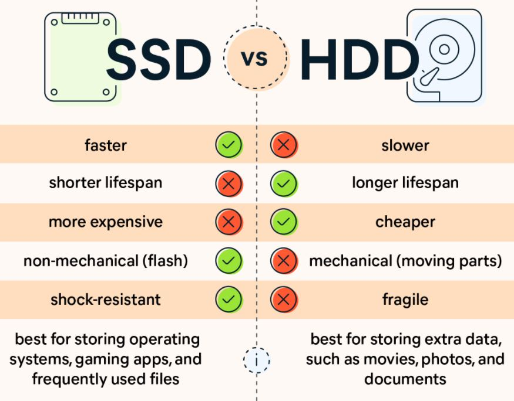

# Speed up data loading
- [1. Faster dataloading]()
  * [1.1. Use SSD instead](#1-use-ssd-instead)
  * [1.2. Multiple workers and pin_memory in DataLoader]()
- [2. Faster data Preprocessing](#2-faster-data-preprocessing)
  * [2.1. Efficient data storage methods](#21-efficient-data-storage-methods)
  * [2.2. Efficient data augmentation library](#22-efficient-data-augmentation-library)
  * [2.3. Data augmentation on GPU](#23-data-augmentation-on-gpu)

## 1. Faster dataloading
### 1.1. Use SSD instead
<div align=center>

</div>

- Training a neural network today often requires massive data, which requires a lot of pointer lookups and reads to the disk. The read and query of HDD is very slow which may become the bottleneck of data processing. Using an SSD can solve this problem quickly. I once did an experiment where it would take two to three days to train a text recognizer with an HDD reading 13 million images, but it only took 4 hours to use an SSD. You don't necessarily need a good GPU, but you definitely need an SSD.

### 1.2. Multiple workers and pin_memory in DataLoader
- Set `num_workers > 0` and `pin_memory=True` in `torch.utils.data.DataLoader` can so can significantly improve your training speed. Within a Python process, the `Global Interpreter Lock (GIL)` prevents true fully parallelizing Python code across threads. To avoid blocking computation code with data loading, PyTorch provides an easy switch to perform multi-process data loading by simply setting the argument num_workers to a positive integer. See [here](https://pytorch.org/docs/stable/data.html#multi-process-data-loading) for more details
- CPU-to-GPU memory transfer is synchronous (i.e. your model training will stop and do CPU-to-GPU memory transfer, slowing your training speed). When you set `pin_memory=True` , these transfers will become asynchronous and your main process will solely focus on model training. This gives another boost.
- Here is an experiment by NVIDIA which achieves a 2x speed-up for a single training epoch by using four workers and pinned memory.

- Usually, set `num_worker = 4 * num_GPU` is recommended.
## 2. Faster data preprocessing
- Data preprocessing is very important in deep learning and speeding up the preprocessing process can save you a lot of time. In the following chapters, I will introduce you to some basic methods, including efficient data storage methods, data preprocessing on the GPU, and libraries to accelerate data preprocessing.
### 2.1. Efficient data storage methods
- When you have a lot of data, try using the `lmdb` format to store the data.
- The full name of LMDB is **Lightning Memory-Mapped Database**. It has a simple file structure, a folder with a data file and a lock file inside. Data can be copied and transferred at will. It is simple to access, no need to run a separate database management process, just refer to the LMDB library in the code that accesses the data, and give the file path when accessing.
- If you have a large amount of image data, say millions, then I suggest you use lmdb for storage, which can significantly improve the data reading speed.
- Here, I provide a simple lmdb converter code, and lmdb dataset construction code. [tools/img2lmdb.py](tools/img2lmdb.py)
### 2.2. Efficient data augmentation library
- Deep neural networks require a lot of training data to obtain good results and prevent overfitting. Image augmentation is a process of creating new training examples from the existing ones.
- [torchvision.transforms](https://pytorch.org/vision/stable/transforms.html) library provides many methods for data augmentation and is widely used. But if your training speed is limited by data augmentation, then you should give [Albumentations](https://github.com/albumentations-team/albumentations) a try.
<div align=center>

</div>

- [Albumentations](https://github.com/albumentations-team/albumentations) is a Python library for image augmentation. It has many advantages and can even be applied to object detection and segmentation. One point we want to focus on here is that it is very fast.
- Here is an experiment to compare the speed of `torchvision.transforms` and `albumentations`
    * **Platform**: Google Colab
    * **Experiment Setup**: We randomly selected **9469 images from ImageNet** and used these two methods for the same data augmentation when loading the data, and counted the time required to traverse the entire data set.
    * **Pseudo-code**:
        ```python
        import time
        from torch.utils.data import DataLoader
        import albumentations as A
        import torchvision.transforms as T
        # use the same augmentation strategy
        transform_albumentations = A.Compose([
            A.Resize(width=384,height=384),
            A.RandomCrop(width=256,height=256),
            A.HorizontalFlip(p=0.5),
            A.RandomBrightnessContrast(p=0.2),
        ])
        # use the same augmentation strategy
        transform_torchvision = T.Compose([
            T.ToPILImage(), # torchvison.transforms take picture in PIL form
            T.Resize(width=384,height=384),
            T.RandomCrop(width=256,height=256),
            T.HorizontalFlip(p=0.5),
            T.RandomBrightnessContrast(p=0.2),
        ])

        transforms = {'albumentations':transform_albumentations,
                'torchvision':transform_torchvision}

        for name, transform in transforms.items():
            dataset = CustomDataset(dataset, transform)
            loader = DataLoader(dataset,batch_size=256,num_workers=2)

            start_time = time.time()
            for batch in loader:
                # only forward
                continue
            cost_time = time.time() - start_time
            print('{} cost time: {}'.format(name,cost_time))
        ```
    * **Results**
      **BS stands for batch size, NW stands for num_workers in dataloader.**
        | Loader Params | Albumentations Time (s) | Torchvision Time (s) | A / T  |
        | ------------- | ----------------------- | -------------------- | ------ |
        | BS=1, NW=1    | 92.40                   | 137.51               | 67%    |
        | BS=2, NW=1    | 86.51                   | 124.77               | 69.34% |
        | BS=32, NW=1   | 81.40                   | 119.75               | 67.97% |
        | BS=128, NW=1  | 78.49                   | 111.60               | 70.33% |
        | BS=256, NW=1  | 78.16                   | 106.83               | 70.33% | 73.16% |
        | BS=128, NW=2  | 64.92                   | 86.33                | 70.33% | 75.20% |
        | BS=256, NW=2  | 64.89                   | 88.26                | 70.33% | 73.52% |
- As you can see from the table above, using `Albumentations` will save you an average of 30% of your time under different experimental settings.

### 2.3. Data augmentation on GPU
- In versions after torchvison 0.8.0, data augmentation on the GPU is now possible. Check [https://github.com/pytorch/vision/releases/tag/v0.8.0] for more details.
- Here is an experiment to compare the speed of torchvision's augmentation on CPU and GPU, respectively
    * **Platform**: Google Colab
    * **Experiment Setup**: We randomly selected **9469 images from ImageNet**. For data augmentation on CPU, we first perform data augmentation on CPU, and then move the augmented image to GPU (`.to('cuda')`). For data augmentation on GPU, we first convert the move to GPU, and then perform data augmentation on GPU. Note that to augment image on GPU, We first need to resize the image to the same size on the CPU, thus building a batch
    * **Pseudo-code**:
        ```python
        import torchvision.transforms as transforms
        import torch
        from torch.utils.data import DataLoader
        import time
        from tqdm import tqdm
        transform_cpu = transforms.Compose([
            transforms.Resize((384,384)),
            transforms.RandomCrop((224,224)),
            transforms.RandomHorizontalFlip(0.5),
            transforms.ColorJitter(0.2,0.2),
        ])
        transform_gpu_resize = transforms.Resize((384,384))
        transform_gpu = torch.nn.Sequential(
            transforms.RandomCrop((224,224)),
            transforms.RandomHorizontalFlip(0.5),
            transforms.ColorJitter(0.2,0.2),
        )
        dataset1 = Customdataset(dataset_path, transform_cpu)
        dataset2 = Customdataset(dataset_path, transform_gpu_resize)
        loader1 = DataLoader(dataset1,batch_size=256,pin_memory=True)
        loader2 = DataLoader(dataset2,batch_size=256,pin_memory=True)

        start_time = time.time()
        for batch in tqdm(loader1):
            batch = batch.to('cuda')
            continue
        print('cpu process time:', time.time()-start_time)

        start_time = time.time()
        for batch in tqdm(loader2):
            batch = batch.to('cuda')
            batch = transform_model(batch)
            continue
        print('gpu process time:', time.time()-start_time)
        ```
    * **Results**

        | Image Nums | CPU Time (s) | GPU Time (s) | G / C  |
        | ---------- | ------------ | ------------ | ------ |
        | 9467       | 116.25       | 106.12       | 91.29% |
        | 2 * 9467   | 223.29       | 206.41       | 92.44% |
        | 3 * 9467   | 345.12       | 310.61       | 90.00% |
        | 4 * 9467   | 455.33       | 415.64       | 91.28% |
- Augment on GPU can save you some time. Although the time savings are not particularly large, it is intuitive to assume that as the amount of data increases, the time savings will be more.
