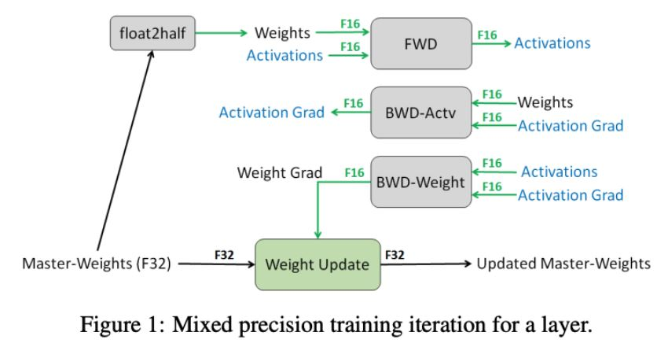
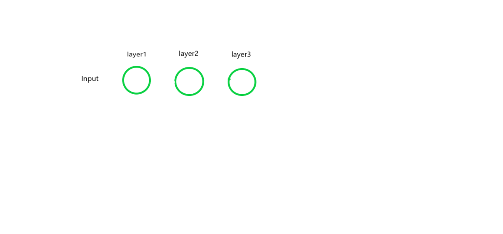
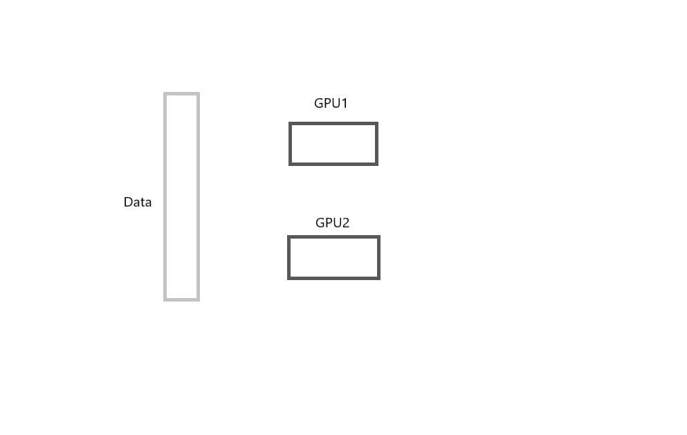

# Efficient GPU Utilization

- [1. CUDA out of memory solutions](#1-cuda-out-of-memory-solutions)
  - [1.1. Use a smaller batch size](#11-use-a-smaller-batch-size)
  - [1.2. Check if there is any accumulated history across your training loop](#12-check-if-there-is-any-accumulated-history-across-your-training-loop)
  - [1.3. Avoid creating new variables](#13-avoid-creating-new-variables)
  - [1.4. Delete intermediate variables you don't need](#14-delete-intermediate-variables-you-dont-need)
  - [1.5. Check if you GPU memory is freed properly](#15-check-if-you-gpu-memory-is-freed-properly)
  - [1.6. Turn off gradient calculation during validation](#16-turn-off-gradient-calculation-during-validation)
  - [1.7. COM in Google Colab](#17-com-in-google-colab)
- [2. GPU Memory Saving Tips](#2-gpu-memory-saving-tips)
  - [2.1. Automatic Mixed Precision (AMP)](#21-automatic-mixed-precisionamp)
  - [2.2. Gradient Accumulation](#22-gradient-accumulation)
  - [2.3. Gradient Checkpoint](#23-gradient-checkpoint)
- [3. Multiple GPUs](#2-multiple-gpus)
  - [3.1. Distributed model training](#31-distributed-model-training)

## 1. CUDA out of memory solutions

<div align=center>
  
</div>

- Anyone engaged in deep learning must have encountered the problem of cuda out of memory.Sometimes It's really frustrating when you've finished writing the code and debugged it for a week to make sure everything is correct. Just when you start training, the program throws a `CUDA out of memory` error. Here are some practical ways to hepl you solve this annoying problem

### 1.1. Use a smaller batch size

- The most frequent cause of this problem is that your batch size is set too large. Try to use a small one.
- In some special scenarios, a smaller batch size may cause your network performance to drop, so a good way to balance this is to use gradient accumulation. Here is an example

    ```python
    accumulation_steps = 10                                                              # Reset gradients tensors
    for i, (inputs, labels) in enumerate(training_set):
        predictions = model(inputs)                     # Forward pass
        loss = loss_function(predictions, labels)       # Compute loss function
        loss = loss / accumulation_steps                # Normalize our loss (if averaged)
        loss.backward()                                 # Backward pass
        if (i+1) % accumulation_steps == 0:             # Wait for several backward steps
            optimizer.step()                            # Now we can do an optimizer step
            model.zero_grad()                           # Reset gradients tensors
            if (i+1) % evaluation_steps == 0:           # Evaluate the model when we...
                evaluate_model()                        # ...have no gradients accumulate
    ```

- As you can see from the code, `model.zero_grad()` is executed only after the forward count reaches `accmulation_step`, i.e. the gradient is accumulated 10 times before updating the parameters. This allows you to have a relatively large batch size while reducing the memory footprint.
- This may also have some minor problems, such as the BN layer may not be calculated accurately, etc.

### 1.2. Check if there is any accumulated history across your training loop

- By default, computations involving variables that require gradients will keep history. This means that you should avoid using such variables in computations which will live beyond your training loops, e.g., when tracking statistics. Instead, you should detach the variable or access its underlying data.
- Here is a bad example:

    ```python
    total_loss = 0
    for i in range(10000):
        optimizer.zero_grad()
        output = model(input)
        loss = criterion(output)
        loss.backward()
        optimizer.step()
        total_loss += loss
    ```

- `total_loss` is defined outside the loop and will keep accumulating in each loop. This can lead to unnecessary memory usage and you can solve it in two ways: use `total_loss += loss.detach()` or `total_loss += loss.item()` instead.

### 1.3. Avoid creating new variables

- Using proper variable names to label different variables can make your codes clear, but in PyTorch, this is not the case. Take a look at an example:

    ```python
    def forward(self, feat):
        a_1 = self.conv1(feat)
        x_1 = self.nonlinear1(a_1)
        a_2 = self.conv2(x_1)
        x_2 = self.nonlinear2(a_2)

        return x_2
    ```

    Statements like `a_1 = self.conv(feat)` creates a new variable `a_1` that take up its own space. We should avoid these redundant values. Use the following code instead:

    ```python
    def forward(self, x):
        x = self.conv1(x)
        x = self.nonlinear1(X)
        x = self.conv2(x)
        x = self.nonlinear2(x)

        return x
    ```

### 1.4. Delete intermediate variables you don't need

- If you assign a Tensor or Variable to a local, Python will not deallocate until the local goes out of scope. You can free this reference by using del x. Similarly, if you assign a Tensor or Variable to a member variable of an object, it will not deallocate until the object goes out of scope. You will get the best memory usage if you don’t hold onto temporaries you don’t need.

    ```python
    for i in range(5):
        intermediate = f(input[i])
        result += g(intermediate)
    output = h(result)
    return output
    ```

- Here, intermediate remains live even while h is executing, because its scope extrudes past the end of the loop. To free it earlier, you should `del intermediate` when you are done with it.

### 1.5. Check if your GPU memory is freed properly

- Sometimes even if your code stops running, the video memory may still be occupied by it. The best way is to find the process engaging gpu memory and kill it
- find the PID of python process from:

    ```bash
    nvidia-smi
    ```

- copy the PID and kill it by:

    ```bash
    sudo kill -9 pid
    ```

### 1.6. Turn off gradient calculation during validation

- You don't need to calculate gradients for forward and backward phase during validation.

    ```python
    with torch.no_grad():
        for batch in loader:
            model.evaluate(batch)
    ```

### 1.7. COM in Google Colab

- If you are getting this error in Google Colab, then try this
  
    ```python
    import torch
    torch.cuda.empty_cache()
    ```
## 2. GPU Memory Saving Tips

- With the rapid development of deep learning, along with the explosive growth of model parameters, the memory capacity of GPU has become more and more demanding, and how to train models on a single card with a small capacity is always a concern. Here, we briefly analyze some common memory saving strategies in Pytorch

### 2.1. Automatic Mixed Precision(AMP)

- The release of PyTorch 1.6 included a native implementation of `Automatic Mixed Precision (AMP)` training. The main idea about AMP is that certain operations can be run faster and without a loss of accuracy at semi-precision (FP16) rather than in the single-precision (FP32) used elsewhere. AMP, then, automatically decide which operation should be executed in which format. This allows both for faster training and a smaller memory footprint.

<div align=center>
  
</div>

- As shown in the figure above, the core of AMP is **mixed precision training** + **dynamic loss amplification**
  - 1. Maintain a copy of the FP32 numerical precision model.
  - 2. During each iteration
    - 2.1. Copy model parameters and convert it to FP16 precision.
    - 2.2. Forward propagate the FP16 model, where weights, activations are in FP16.
    - 2.3. Calculate the loss, and multiply the loss by a `scale factor 's'`
    - 2.4. The back propagation, where gradients are also in FP16.
    - 2.5. Gradient multiplied by `1/s`
    - 2.6. Update the model parameters of FP32 using the gradient of FP16
- **scale factor**: One thing that happens because of this will be that a 16-bit variable’s gradient will be also stored in 16 bits. But what if it underflows (i.e. the gradient is too small to be stored in 16 bits, in which case it will just become zero). A scale factor is multiplied to such gradients, which pushes the zero gradient value to a substantial value and doesn’t affect training. This process is called grad scaling.
- Here is an example from [Pytorch](https://pytorch.org/docs/stable/notes/amp_examples.html)

  ```python
  # Creates model and optimizer in default precision
  model = Net().cuda()
  optimizer = optim.SGD(model.parameters(), ...)

  # Creates a GradScaler once at the beginning of training.
  scaler = torch.cuda.amp.GradScaler()

  for epoch in epochs:
      for input, target in data:
          optimizer.zero_grad()

          # Runs the forward pass with autocasting.
          with torch.cuda.amp.autocast():
              output = model(input)
              loss = loss_fn(output, target)

          # Scales loss.  Calls backward() on scaled loss to create scaled gradients.
          # Backward passes under autocast are not recommended.
          # Backward ops run in the same dtype autocast chose for corresponding forward ops.
          scaler.scale(loss).backward()

          # scaler.step() first unscales the gradients of the optimizer's assigned params.
          # If these gradients do not contain infs or NaNs, optimizer.step() is then called,
          # otherwise, optimizer.step() is skipped.
          scaler.step(optimizer)

          # Updates the scale for next iteration.
          scaler.update()
  ```

- **Experiments**: Here is an experiment from this [blog](https://spell.ml/blog/mixed-precision-training-with-pytorch-Xuk7YBEAACAASJam) that tests the training time and memory usage of different models using AMP

    | Model         | GPU  | Without AMP | With AMP    |
    | ------------- | ---- | ----------- | ----------- |
    | Tiny Feedward | V100 | 10m 10s     | 10 m 55s    |
    |               | T4   | 8m 43s      | 8m 39s      |
    | UNet          | V100 | 8m 25s      | **7m 58s**  |
    |               | T4   | 13m 7s      | **9m 14s**  |
    | BERT          | V100 | 17m 38s     | **8m 10s**  |
    |               | T4   | 55m17s      | **20m 27s** |

    | Model         | GPU  | Without AMP | With AMP    |
    | ------------- | ---- | ----------- | ----------- |
    | Tiny Feedward | V100 | 1.19 GB     | 1.19 GB     |
    |               | T4   | 0.932 GB    | 0.936 GB    |
    | UNet          | V100 | 4.33 GB     | **3.71 GB** |
    |               | T4   | 4.26 GB     | **2.67 GB** |
    | BERT          | V100 | 9.62 GB     | **8.76 G**  |
    |               | T4   | 9.35 GB     | **8.49 GB** |

- In conclusion, when your have a huge model, use AMP can save you a lot of time and some GPU memory.

### 2.2. Gradient Accumulation

- The most frequent cause of CUDA out of memory is that your batch size is set too large and you can use a small one. However, In some scenarios like object detection, a smaller batch size may cause your network performance to drop, so a good way to balance this is to use gradient accumulation.
- The core idea is to accumulate the first few gradients and then update the parameters uniformly, thus disguising the large batch size function. Here is an example

    ```python
    accumulation_steps = 10                                                              # Reset gradients tensors
    for i, (inputs, labels) in enumerate(training_set):
        predictions = model(inputs)                     # Forward pass
        loss = loss_function(predictions, labels)       # Compute loss function
        loss = loss / accumulation_steps                # Normalize our loss (if averaged)
        loss.backward()                                 # Backward pass
        if (i+1) % accumulation_steps == 0:             # Wait for several backward steps
            optimizer.step()                            # Now we can do an optimizer step
            model.zero_grad()                           # Reset gradients tensors
            if (i+1) % evaluation_steps == 0:           # Evaluate the model when we...
                evaluate_model()                        # ...have no gradients accumulate
    ```

- As you can see from the code, `model.zero_grad()` is executed only after the forward count reaches `accmulation_step`, i.e. the gradient is accumulated 10 times before updating the parameters. This allows you to have a relatively large batch size while reducing the memory footprint.
- Note that there may be a slight performance difference if the model includes layers that take batch information into account, such as BN. This is an Experiment conduct by [MMCV](https://github.com/open-mmlab/mmcv/pull/1221). Using gradient accumulation in the presence of BN may degrade model performance, but this problem should be mitigated when the Batch size is large
  - **Faster RCNN without BatchNorm**

        | samples_per_gpu | cumulative_iters | bbox_mAP |
        | --------------- | ---------------- | -------- |
        | 2               | 1                | 0.3770   |
        | 1               | 2                | 0.3770   |
        | 1               | 1                | 0.3660   |

  - **ResNet-34 with BatchNorm**

        | samples_per_gpu | cumulative_iters | accuracy |
        | --------------- | ---------------- | -------- |
        | 32              | 1                | 73.85    |
        | 16              | 2                | 73.25    |
        | 16              | 1                | 73.19    |

### 2.3. Gradient Checkpoint

- Gradient Checkpoint is another useful trick to save your GPU memory which is a time for space technique
- **How neural networks use memory**: In order to understand how gradient checkpoint helps, we first need to understand a bit about how model memory allocation works. The total memory used by a neural network is basically the sum of two components.
  - The first component is the static memory used by the model
  - The second component is the dynamic memory taken up by the model's computational graph. Every forward pass through a neural network in train mode computes an activation for every neuron in the network; this value is then stored in the so-called computation graph. One value must be stored for every single training sample in the batch, so this adds up quickly. The total cost is determined by model size and batch size, and sets the limit on the maximum batch size that will fit into your GPU memory.
- **How Gradient Checkpoint Helps**: The network retains intermediate variables during the forward propagation in order to calculate the gradient during the backward. Gradient checkpoint works by not retaining intermediate variables during the forward propagation but recalculating them during the backward. This can save a lot of memory, but the consequence is that the training time will be longer.
- **Usage in Pytorch**:

    ```python
    import torch.nn as nn
    from torch.utils.checkpoint import checkpoint
    class Model(nn.Module):
        super(Model, self).__init__()
        def __init__(self):
            self.layer1 = nn.Conv2d(3,64,3,1,1)
            self.layer2 = nn.Conv2d(64,64,3,1,1)
            self.layer3 = nn.Conv2d(64,32,3,1,1)
        def forward(self,x):
            x = self.layer1(x)
            x = checkpoint(self.layer2, x)
            x = self.layer(x)
            return x
    ```

    - **checkpoint** in forward takes a module and its arguments as input. Then the intermediate output by this module (self.layer2) will not be kept in the computation graph, and  will be recalculated during the backpropagation instead.



- **Experiments**: Here is an experiment from [Explore Gradient-Checkpointing in PyTorch](https://qywu.github.io/2019/05/22/explore-gradient-checkpointing.html). It's is an experiment to do classification with BERT, and gradient checkpoint is add to the Multi Head Self Attention module (MHSA) and GeLU in BERT. Using gradient checkpoint can save of lot of GPU memory without droping the performance.

    | Gradient checkpoint | Batch size | GPU Memory | Time for one epoch | Validation Accuracy after one epoch |
    | ------------------- | ---------- | ---------- | ------------------ | ----------------------------------- |
    | No                  | 24         | 10972MB    | 27min05s           | 0.7997                              |
    | Yes                 | 24         | 3944MB     | 36min50s           | 0.7997                              |
    | Yes                 | 132        | 10212MB    | 31min20s           | 0.7946                              |
- **Cautions**: Gradient checkpoint is very useful, but be careful where you use it
  - **Do not use on input layer**. The checkpoint detects whether the input tensor has a gradient or not, and thus performs the relevant operation. The input layer generally uses an image as input, which has no gradient, so it is useless to perform checkpoint on the input layer.
  - **No dropout, BN or so**: This is because checkpointing is incompatible with dropout (recall that effectively runs the sample through the model twice—dropout would arbitrarily drop different values in each pass, producing different outputs). Basically, any layer that exhibits non-idempotent behavior when rerun shouldn't be checkpointed (nn.BatchNorm is another example).

## 3. Multiple GPUs

### 3.1. Distributed model training

#### What is distributed training

- With the rapid development of deep learning, the model parameters are exponentially exploding, challenging the ability of even the most powerful of GPU cards to finish model training jobs in a reasonable amount of time.
- To solve this problem, a technique called distributed training is gaining popularity.
- **Distributed training** is the set of techniques for training a deep learning model using multiple GPUs and/or multiple machines. Distributing training jobs allow you to push past the single-GPU memory bottleneck, developing ever larger and powerful models by leveraging many GPUs simultaneously.
- There are basically two different forms of distributed training in common use today: data parallelization and model parallelization.
  - **data parallelization**: In data parallelization, the model training job is split on the data. Each GPU in the job receives its own independent slice of the data batch, e.g. its own "batch slice". Each GPU uses this data to independently calculate a gradient update. For example, if you were to use two GPUs and a batch size of 32, one GPU would handle forward and back propagation on the first 16 records, and the second the last 16. These gradient updates are then synchronized among the GPUs, averaged together, and finally applied to the model.
  - **model parallelization**: In model parallelization, the model training job is split on the model. Each GPU in the job receives a slice of the model, e.g. a subset of its layers. So for example, one GPU might be responsible for its output head,another might handle the input layers, and another, the hidden layers in between.

#### Data parallelization training
- The gif below shows how it works:
  - 1. Each GPU maintains its own copy of the model weights.
  - 2. Upon receiving the go signal, each worker process draws a disjoint batch from the dataset and computes a gradient for that batch.
  - 3. The workers use an algorithm called `all-reduce` to synchronize their individual gradients, computing the same average gradient on all nodes locally
  - 4. Each worker applies the gradient update to its local copy of the model.
  - 5. The next batch of training begins.



## Reference

- [Training larger-than-memory PyTorch models using gradient checkpointing](https://spell.ml/blog/gradient-checkpointing-pytorch-YGypLBAAACEAefHs)
- [Explore Gradient-Checkpointing in PyTorch](https://qywu.github.io/2019/05/22/explore-gradient-checkpointing.html)
- [https://spell.ml/blog/mixed-precision-training-with-pytorch-Xuk7YBEAACAASJam](https://spell.ml/blog/mixed-precision-training-with-pytorch-Xuk7YBEAACAASJam)
- [Distributed model training in PyTorch using DistributedDataParallel](https://spell.ml/blog/pytorch-distributed-data-parallel-XvEaABIAAB8Ars0e)