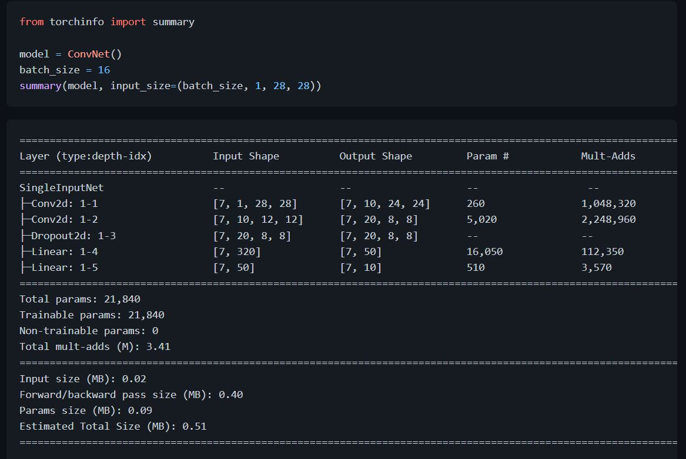
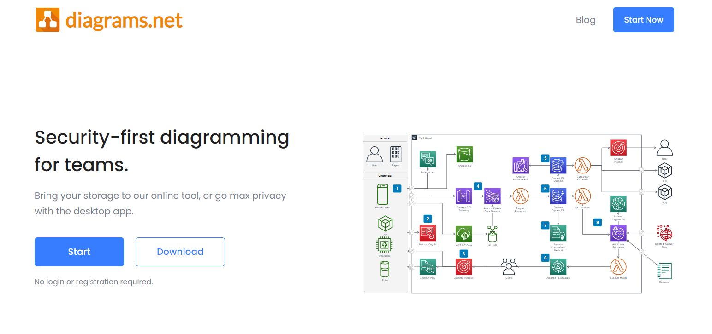

# Efficient Tools
## 1. Torchinfo: Visualize Network Architecture
- If there is something you can fall in love with at first sight, then [torchinfo](https://github.com/TylerYep/torchinfo) must be one of them!
- [Torchinfo]((https://github.com/TylerYep/torchinfo)) provides information complementary to what is provided by print(your_model) in PyTorch, similar to Tensorflow's model.summary() API to view the visualization of the model, which is helpful while debugging your network.

## 2. drawio: Free graphing software
- `website`: [https://github.com/jgraph/drawio-desktop](https://github.com/jgraph/drawio-desktop)
- drwaio is a diagramming and whiteboarding desktop app based on Electron that wraps the core draw.io editor.

- BTW, drawio is also supported in Vscode's plugin.
