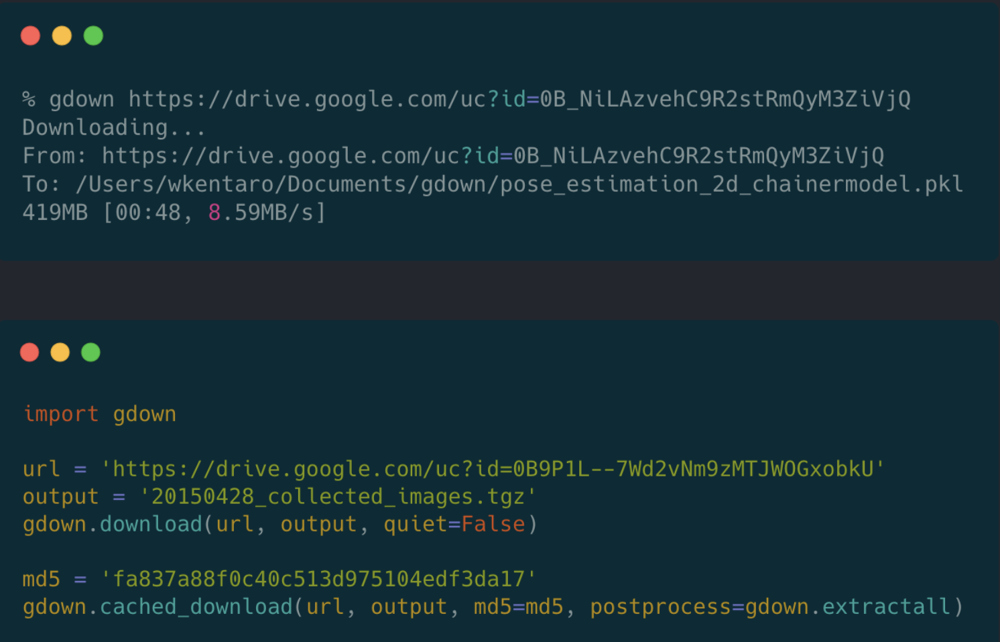

# Efficient Tools

- [Efficient Tools](#efficient-tools)
  - [1. Torchinfo: Visualize Network Architecture](#1-torchinfo-visualize-network-architecture)
  - [2. drawio: Free graphing software](#2-drawio-free-graphing-software)
  - [3. Octotree: Free gitHub code tree](#3-octotree-free-github-code-tree)
  - [4. AI pair programmer: Github Copilot](#4-ai-pair-programmer-github-copilot)
  - [5. PARSEC: Free Remote Desktop](#5-parsec-free-remote-desktop)
  - [6. gdown: Download Large files from Google Drive in command line](#6-gdown-download-large-files-from-google-drive-in-command-line)
- [Reference](#reference)
## 1. Torchinfo: Visualize Network Architecture

- **Website**:[https://github.com/TylerYep/torchinfo](https://github.com/TylerYep/torchinfo)
- If there is something you can fall in love with at first sight, then [torchinfo](https://github.com/TylerYep/torchinfo) must be one of them!
- [Torchinfo](https://github.com/TylerYep/torchinfo) provides information complementary to what is provided by print(your_model) in PyTorch, similar to Tensorflow's model.summary() API to view the visualization of the model, which is helpful while debugging your network.

## 2. drawio: Free graphing software

- **Website**: [https://github.com/jgraph/drawio-desktop](https://github.com/jgraph/drawio-desktop)
- drwaio is a diagramming and whiteboarding desktop app based on Electron that wraps the core draw.io editor.

- Here is an example of using DrawIO to draw a neural network structure: [How to Easily Draw Neural Network Architecture Diagrams](https://towardsdatascience.com/how-to-easily-draw-neural-network-architecture-diagrams-a6b6138ed875)

## 3. Octotree: Free gitHub code tree

- **Website**:[https://www.octotree.io/](https://www.octotree.io/)
- [Octotree](https://chrome.google.com/webstore/detail/octotree-github-code-tree/bkhaagjahfmjljalopjnoealnfndnagc) is a powerful and free plugin for displaying Github project code in a tree format that can drastically improve your github experience. If you're as heavily addicted to github as I am, then you can't miss it.

  

## 4. AI pair programmer: Github Copilot

  

- GitHub Copilot is powered by the OpenAI. Copilot is a modified, production version of the Generative Pre-trained Transformer 3 (GPT-3), a language model using deep-learning to produce human-like text.
- For example, when provided with a programming problem in natural language, copilot is capable of generating solution code. It is also able to describe input code in English and translate code between programming languages.
- Copilot’s OpenAI is trained on a selection of the English language, public GitHub repositories, and other publicly available source code. This includes a filtered dataset of 159 gigabytes of Python code sourced from 54 million public GitHub repositories.
- Here are some examples of what copilot can do:
  * Generate a solution to a programming problem
  * Describe a code snippet in English
  * Translate code between programming languages

  

## 5. PARSEC: Free Remote Desktop

  

- **Website**: [https://parsec.app](https://parsec.app)
- Parsec is a free, HD, powerful remote desktop. It allows you to play games with your friends, watch movies with your family, or collaborate with colleagues from anywhere.

## 6. gdown: Download Large files from Google Drive in command line

  

- **Github**: [https://github.com/wkentaro/gdown](https://github.com/wkentaro/gdown)
- We all faced the problem of downloading large files from Google Drive. The download speed is very slow, and it is easy to be interrupted. Moreover, it is difficult to download on linux. gdown is a command line tool that can download large files from Google Drive in command line. It is very easy to use, and the download speed is very fast.

# Reference
- [知乎: 有没有什么可以节省大量时间的 Deep Learning 效率神器？](https://www.zhihu.com/question/384519338/answer/1196326124?utm_source=wechat_session&utm_medium=social&utm_oi=1094267717124816896&utm_content=group1_Answer&utm_campaign=shareopn)
- [Linggle | 英文写作的必备网站](https://zhuanlan.zhihu.com/p/64115657)

