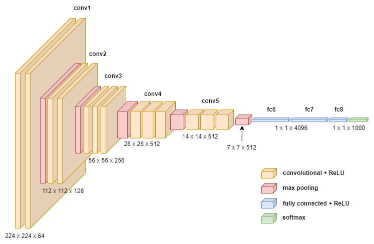
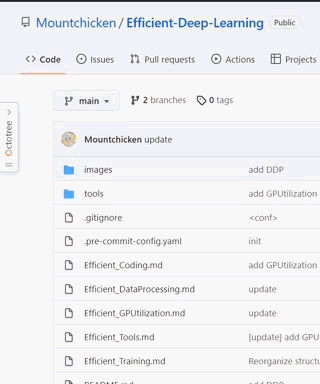
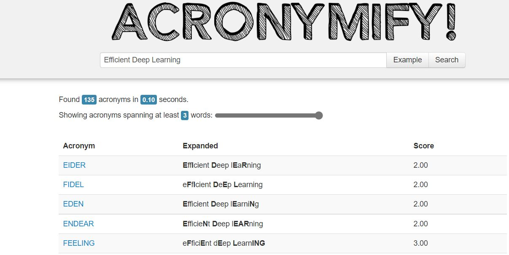
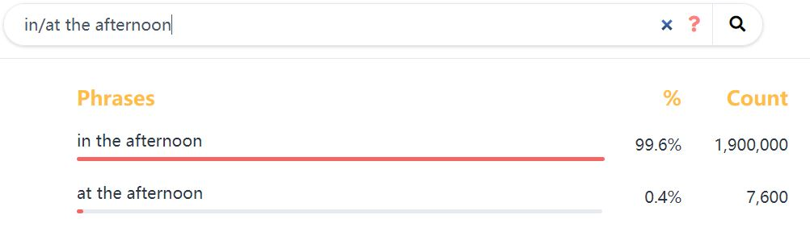
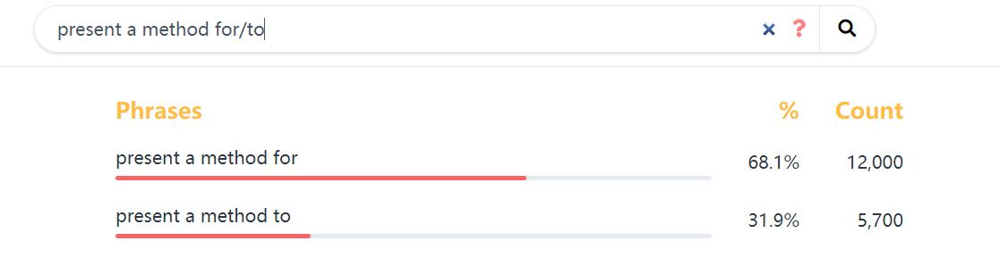
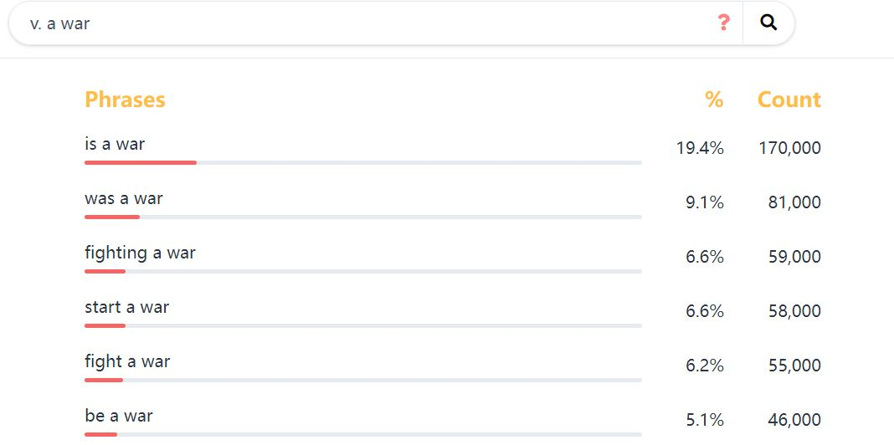
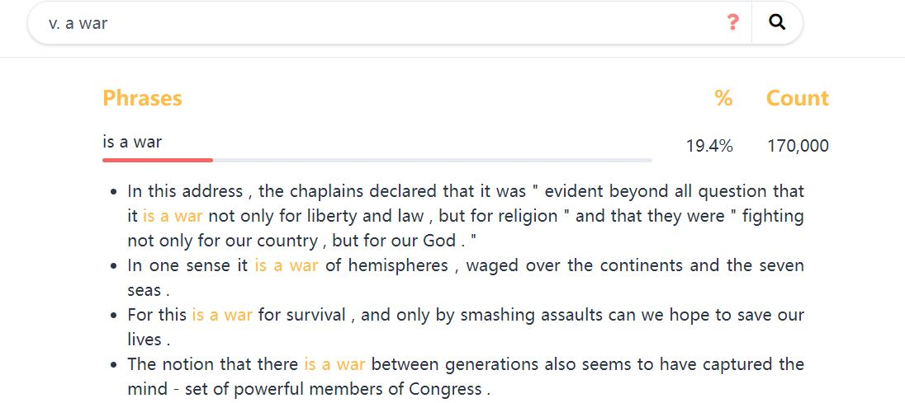
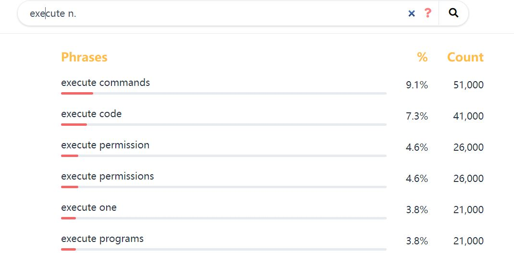

# Efficient Tools

- [Efficient Tools](#efficient-tools)
  - [1. Torchinfo: Visualize Network Architecture](#1-torchinfo-visualize-network-architecture)
  - [2. drawio: Free graphing software](#2-drawio-free-graphing-software)
  - [3. Octotree: Free gitHub code tree](#3-octotree-free-github-code-tree)
  - [4. ACRONYMIFY: Name your paper with a cool acronyms](#4-acronymify-name-your-paper-with-a-cool-acronyms)
  - [5. Linggle: Grammer checker](#5-linggle-grammer-checker)
      - [Search for the correct preposition pairing](#search-for-the-correct-preposition-pairing)
      - [What can be the verb before `war`?](#what-can-be-the-verb-before-war)
      - [What nouns can be used after `execute`?](#what-nouns-can-be-used-after-execute)
      - [Check the usage for authenticity](#check-the-usage-for-authenticity)
  - [6. AI pair programmer: Github Copilot](#6-ai-pair-programmer-github-copilot)
  - [7. PARSEC: Free Remote Desktop](#7-parsec-free-remote-desktop)
- [Reference](#reference)
## 1. Torchinfo: Visualize Network Architecture

- **Website**:[https://github.com/TylerYep/torchinfo](https://github.com/TylerYep/torchinfo)
- If there is something you can fall in love with at first sight, then [torchinfo](https://github.com/TylerYep/torchinfo) must be one of them!
- [Torchinfo](https://github.com/TylerYep/torchinfo) provides information complementary to what is provided by print(your_model) in PyTorch, similar to Tensorflow's model.summary() API to view the visualization of the model, which is helpful while debugging your network.

## 2. drawio: Free graphing software

- **Website**: [https://github.com/jgraph/drawio-desktop](https://github.com/jgraph/drawio-desktop)
- drwaio is a diagramming and whiteboarding desktop app based on Electron that wraps the core draw.io editor.

- Here is an example of using DrawIO to draw a neural network structure: [How to Easily Draw Neural Network Architecture Diagrams](https://towardsdatascience.com/how-to-easily-draw-neural-network-architecture-diagrams-a6b6138ed875)

## 3. Octotree: Free gitHub code tree

- **Website**:[https://www.octotree.io/](https://www.octotree.io/)
- [Octotree](https://chrome.google.com/webstore/detail/octotree-github-code-tree/bkhaagjahfmjljalopjnoealnfndnagc) is a powerful and free plugin for displaying Github project code in a tree format that can drastically improve your github experience. If you're as heavily addicted to github as I am, then you can't miss it.

  

## 4. ACRONYMIFY: Name your paper with a cool acronyms

- **Website**:[http://acronymify.com/](http://acronymify.com/)
- A good paper naming not only motivates the reader to read, but also makes your paper memorable, for example by using abbreviations of words to construct an interesting word. A typical example is the Sesame Street Family in NLP (BERT, ELMO, ERNIE ...). [Acronymify](http://acronymify.com/search?q=Efficient+Deep+Learning) can automatically generate a series of acronyms for the title of your paper, and you pick the one you like

  

## 5. Linggle: Grammer checker
- **Website**: [https://linggle.com/](https://linggle.com/)
- When you are writing in English, have you ever encountered these similar problems:
  * `in the afternoon`, `at the afternoon`, which one is correct?
  * The preposition after `present a method` is `for` or `to`.
  * What can be the verb before `war`?
  * What nouns can be used after `execute`
  * I just made up an expression `avoid his coming`, trying to determine if it was authentic.
- Let's see how linggle can help you with it
#### Search for the correct preposition pairing

- **Use / to space out the prepositions**:

  

  

- Linggle can look up the usage of relevant prepositions in its corpus and tell you which ones are most commonly used, and will give you many examples

#### What can be the verb before `war`?
- **We can use `v. a war` to query.**, `v. a war` means verb ahead war.

  

  

#### What nouns can be used after `execute`?
- **`excute n.`**

  

#### Check the usage for authenticity

  

- Saddly, `avoid his coming` is not authentic.

- **Linggle can do much more than those, and you can see more usages on its website.**

## 6. AI pair programmer: Github Copilot

  

- GitHub Copilot is powered by the OpenAI. Copilot is a modified, production version of the Generative Pre-trained Transformer 3 (GPT-3), a language model using deep-learning to produce human-like text.
- For example, when provided with a programming problem in natural language, copilot is capable of generating solution code. It is also able to describe input code in English and translate code between programming languages.
- Copilot’s OpenAI is trained on a selection of the English language, public GitHub repositories, and other publicly available source code. This includes a filtered dataset of 159 gigabytes of Python code sourced from 54 million public GitHub repositories.
- Here are some examples of what copilot can do:
  * Generate a solution to a programming problem
  * Describe a code snippet in English
  * Translate code between programming languages

  

## 7. PARSEC: Free Remote Desktop

  

- **Website**: [https://parsec.app](https://parsec.app)
- Parsec is a free, HD, powerful remote desktop. It allows you to play games with your friends, watch movies with your family, or collaborate with colleagues from anywhere.

# Reference
- [知乎: 有没有什么可以节省大量时间的 Deep Learning 效率神器？](https://www.zhihu.com/question/384519338/answer/1196326124?utm_source=wechat_session&utm_medium=social&utm_oi=1094267717124816896&utm_content=group1_Answer&utm_campaign=shareopn)
- [Linggle | 英文写作的必备网站](https://zhuanlan.zhihu.com/p/64115657)

