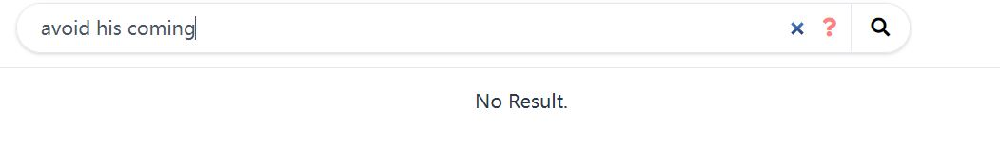

# Efficient Tools

- [Torchinfo: Visualize Network Architecture](#1-torchinfo-visualize-network-architecture)
- [DrawIO: Free graphing software](#2-drawio-free-graphing-software)
- [Octotree: Free gitHub code tree](#3-octotree-free-github-code-tree)
- [ACRONYMIFY: Name your paper with a cool acronyms](#4-acronymify-name-your-paper-with-a-cool-acronyms)
- [Linggle: Grammer checker](#5-linggle-grammer-checker)
## 1. Torchinfo: Visualize Network Architecture

- **Website**:[https://github.com/TylerYep/torchinfo](https://github.com/TylerYep/torchinfo)
- If there is something you can fall in love with at first sight, then [torchinfo](https://github.com/TylerYep/torchinfo) must be one of them!
- [Torchinfo](https://github.com/TylerYep/torchinfo) provides information complementary to what is provided by print(your_model) in PyTorch, similar to Tensorflow's model.summary() API to view the visualization of the model, which is helpful while debugging your network.

## 2. drawio: Free graphing software

- **Website**: [https://github.com/jgraph/drawio-desktop](https://github.com/jgraph/drawio-desktop)
- drwaio is a diagramming and whiteboarding desktop app based on Electron that wraps the core draw.io editor.

- Here is an example of using DrawIO to draw a neural network structure: [How to Easily Draw Neural Network Architecture Diagrams](https://towardsdatascience.com/how-to-easily-draw-neural-network-architecture-diagrams-a6b6138ed875)

## 3. Octotree: Free gitHub code tree

- **Website**:[https://www.octotree.io/](https://www.octotree.io/)
- [Octotree](https://chrome.google.com/webstore/detail/octotree-github-code-tree/bkhaagjahfmjljalopjnoealnfndnagc) is a powerful and free plugin for displaying Github project code in a tree format that can drastically improve your github experience. If you're as heavily addicted to github as I am, then you can't miss it.

  

## 4. ACRONYMIFY: Name your paper with a cool acronyms

- **Website**:[http://acronymify.com/](http://acronymify.com/)
- A good paper naming not only motivates the reader to read, but also makes your paper memorable, for example by using abbreviations of words to construct an interesting word. A typical example is the Sesame Street Family in NLP (BERT, ELMO, ERNIE ...). [Acronymify](http://acronymify.com/search?q=Efficient+Deep+Learning) can automatically generate a series of acronyms for the title of your paper, and you pick the one you like

  

## 5. Linggle: Grammer checker
- **Website**: [https://linggle.com/](https://linggle.com/)
- When you are writing in English, have you ever encountered these similar problems:
  * `in the afternoon`, `at the afternoon`, which one is correct?
  * The preposition after `present a method` is `for` or `to`.
  * What can be the verb before `war`?
  * What nouns can be used after `execute`
  * I just made up an expression `avoid his coming`, trying to determine if it was authentic.
- Let's see how linggle can help you with it
#### 1. Search for the correct preposition pairing

- **Use / to space out the prepositions**:

  

  

- Linggle can look up the usage of relevant prepositions in its corpus and tell you which ones are most commonly used, and will give you many examples

#### 2. What can be the verb before `war`?
- **We can use `v. a war` to query.**, `v. a war` means verb ahead war.

  

  

#### 3. What nouns can be used after `execute`?
- **`excute n.`**

  

#### 4. Check the usage for authenticity

  

- Saddly, `avoid his coming` is not authentic.

- **Linggle can do much more than those, and you can see more usages on its website.**

# Reference
- [知乎: 有没有什么可以节省大量时间的 Deep Learning 效率神器？](https://www.zhihu.com/question/384519338/answer/1196326124?utm_source=wechat_session&utm_medium=social&utm_oi=1094267717124816896&utm_content=group1_Answer&utm_campaign=shareopn)
- [Linggle | 英文写作的必备网站](https://zhuanlan.zhihu.com/p/64115657)

