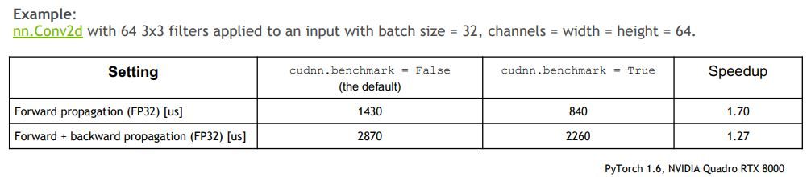
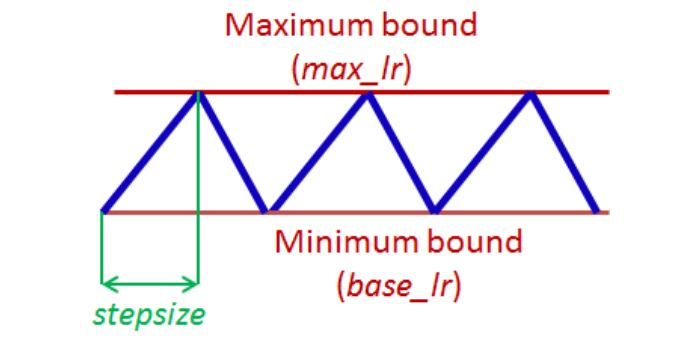

# Efficient Training
- Here are some training strategies that can speed up the training process of your network
- [1. Faster training speed]()
  * [1.1. Set cudnn.benchmark=True]()
  * [1.2. Set gradients to None during back propagation]()
  * [1.3. Turn off debugging APIs]()
  * [1.4. Use Automatic Mixed Precision (AMP)]()
  * [1.5. Turn off gradient computation during validation]()
- [2. Faster convergence speed]()
  * [2.1. Use another optimizer AdamW]()
  * [2.2. Learning rate schedule]()
  
## 1. Faster traing speed
### 1.1. Set cudnn.benchmark=True
- If your model architecture remains **fixed and your input size stays constant**, setting `torch.backends.cudnn.benchmark = True` might be beneficial [docs](https://pytorch.org/docs/stable/backends.html#torch-backends-cudnn). This enables the cudNN autotuner which will benchmark a number of different ways of computing convolutions in cudNN and then use the fastest method from then on. 
- Add the following lines in your training code
```python
torch.backends.cudnn.benchmark = True
```
- This is a reference experiment from NVIDIA. A speedup of 70% was achieved on the forward  of a single convolution, and a speedup of 27% was achieved on the forward + backward propagation of a single convolution.

### 1.2. Set gradients to None during back propagation
- Normally, we use `optimizer.zero_grad()` or `model.zero_grad()` during back propagation. However, there is another trick by setting gradients to None.
- `model.zero_grad()` is something you see in every PyTorch code. This sets the gradients from the last step to zero. This is a huge problem. When we call this function, separate CUDA kernels are launched, creating unnecessary overhead. Also, this function leads to a read + write operation during backpropagation (due to use of the += operation, read is triggered by the + and write is triggered by the =).
- Replace `model.zero_grad()` with codes below:
  ```python
  # model.zero_grad()
  for param in model.parameters():
      param.grad = None
  ```
- It doesn’t create the unnecessary overhead of setting the memory for each variable. It directly sets the gradients (i.e. only the write operation is done, unlike model.zero_grad()).
### 1.3. Turn off debugging 
- Once you are done debugging your model, you should stop the usage of all the debug APIs because they have a significant overhead.
- Add the following lines after your imports in your code:
```
torch.autograd.set_detect_anomaly(False)
torch.autograd.profiler.profile(False)
torch.autograd.profiler.emit_nvtx(False)
```
- The first line warns you about any gradients that are getting a NaN or infinity value when True.
- The second line tells you about the time spent for each operation on CPU and GPU when True.
- The third line creates an annotated timeline for your run that can be visualized by NVIDIA Visual Profiler (NVP) when True.

### 1.4. Turn off gradient computation during validation
- During validation, use `with torch.no_grad()` to decorate your code
  ```python
  with torch.no_grad():
    model.evaluate()
  ```

### 1.5. Use Automatic Mixed Precision (AMP)
- The release of PyTorch 1.6 included a native implementation of Automatic Mixed Precision training to PyTorch. The main idea here is that certain operations can be run faster and without a loss of accuracy at semi-precision (FP16) rather than in the single-precision (FP32) used elsewhere. AMP, then, automatically decide which operation should be executed in which format. This allows both for faster training and a smaller memory footprint.
- Now, one thing that will happen because of this will be that a 16-bit variable’s gradient will be also stored in 16 bits. But what if it underflows (i.e. the gradient is too small to be stored in 16 bits, in which case it will just become zero). A scale factor is multiplied to such gradients, which pushes the zero gradient value to a substantial value and doesn’t affect training. This process is called grad scaling.
- Here is an example from [Pytorch](https://pytorch.org/docs/stable/notes/amp_examples.html)
  ```python
  # Creates model and optimizer in default precision
  model = Net().cuda()
  optimizer = optim.SGD(model.parameters(), ...)

  # Creates a GradScaler once at the beginning of training.
  scaler = GradScaler()

  for epoch in epochs:
      for input, target in data:
          optimizer.zero_grad()

          # Runs the forward pass with autocasting.
          with autocast():
              output = model(input)
              loss = loss_fn(output, target)

          # Scales loss.  Calls backward() on scaled loss to create scaled gradients.
          # Backward passes under autocast are not recommended.
          # Backward ops run in the same dtype autocast chose for corresponding forward ops.
          scaler.scale(loss).backward()

          # scaler.step() first unscales the gradients of the optimizer's assigned params.
          # If these gradients do not contain infs or NaNs, optimizer.step() is then called,
          # otherwise, optimizer.step() is skipped.
          scaler.step(optimizer)

          # Updates the scale for next iteration.
          scaler.update()
  ```

## 2. Faster convergence speed
### 2.1. Use another optimizer AdamW
- AdamW is Adam with weight decay (rather than L2-regularization) which was popularized by fast.ai and is now available natively in PyTorch as `torch.optim.AdamW`. AdamW seems to consistently outperform Adam in terms of both the error achieved and the training time. See this [excellent blog](https://www.fast.ai/2018/07/02/adam-weight-decay/) post on why using weight decay instead of L2-regularization makes a difference for Adam.
### 2.2. Learning rate schedule
- The learning rate (schedule) you choose has a large impact on the speed of convergence as well as the generalization performance of your model. `Cyclical learning rate` and the `1Cycle learning rate` schedule seem to accelerate convergence.

- PyTorch implements both of these methods `torch.optim.lr_scheduler.CyclicLR` and `torch.optim.lr_scheduler.OneCycleLR`, see [here]() for more details.