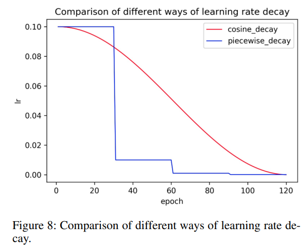
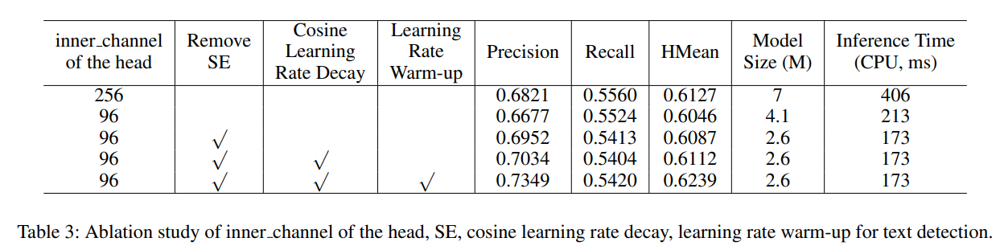
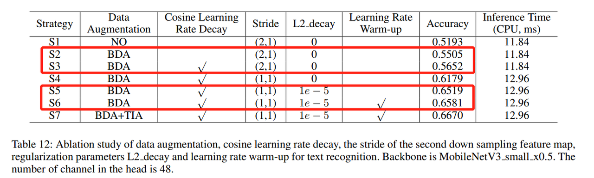

# Efficient Training

- Here are some training strategies that can speed up the training process of your network
- [1. Faster training speed](#1-faster-traing-speed)
  - [1.1. Set cudnn.benchmark=True](#11-set-cudnnbenchmarktrue)
  - [1.2. Set gradients to None during back propagation](#12-set-gradients-to-none-during-back-propagation)
  - [1.3. Turn off debugging APIs](#13-turn-off-debugging)
  - [1.4. Turn off gradient computation during validation](#14-turn-off-gradient-computation-during-validation)
- [2. Faster convergence speed](#2-faster-convergence-speed)
  - [2.1. Use another optimizer AdamW](#21-use-another-optimizer-adamw)
  - [2.2. Learning rate schedule](#22-cyclical-learning-rate-schedule)
  - [2.3. Best combination, Adam with 3e-4](#23-best-combination-adam-with-3e-4)
  - [2.4. LR Warm up and Cosine Learning Rate Decay](#24-lr-warm-up-and-cosine-learning-rate-decay)
  - [2.5 L2 decay](#25-l2-decay)
- [3. Visualize and log informations]()

## 1. Faster traing speed

### 1.1. Set cudnn.benchmark=True

- If your model architecture remains **fixed and your input size stays constant**, setting `torch.backends.cudnn.benchmark = True` might be beneficial [docs](https://pytorch.org/docs/stable/backends.html#torch-backends-cudnn). This enables the cudNN autotuner which will benchmark a number of different ways of computing convolutions in cudNN and then use the fastest method from then on.
- Add the following lines in your training code

```python
torch.backends.cudnn.benchmark = True
```

- This is a reference experiment from NVIDIA. A speedup of 70% was achieved on the forward  of a single convolution, and a speedup of 27% was achieved on the forward + backward propagation of a single convolution.


### 1.2. Set gradients to None during back propagation

- Normally, we use `optimizer.zero_grad()` or `model.zero_grad()` during back propagation. However, there is another trick by setting gradients to None.
- `model.zero_grad()` is something you see in every PyTorch code. This sets the gradients from the last step to zero. This is a huge problem. When we call this function, separate CUDA kernels are launched, creating unnecessary overhead. Also, this function leads to a read + write operation during backpropagation (due to use of the += operation, read is triggered by the + and write is triggered by the =).
- Replace `model.zero_grad()` with codes below:

  ```python
  # model.zero_grad()
  for param in model.parameters():
      param.grad = None
  ```

- It doesn’t create the unnecessary overhead of setting the memory for each variable. It directly sets the gradients (i.e. only the write operation is done, unlike model.zero_grad()).

### 1.3. Turn off debugging

- Once you are done debugging your model, you should stop the usage of all the debug APIs because they have a significant overhead.
- Add the following lines after your imports in your code:

  ```python
  torch.autograd.set_detect_anomaly(False)
  torch.autograd.profiler.profile(False)
  torch.autograd.profiler.emit_nvtx(False)
  ```

- The first line warns you about any gradients that are getting a NaN or infinity value when True.
- The second line tells you about the time spent for each operation on CPU and GPU when True.
- The third line creates an annotated timeline for your run that can be visualized by NVIDIA Visual Profiler (NVP) when True.

### 1.4. Turn off gradient computation during validation

- During validation, use `with torch.no_grad()` to decorate your code

  ```python
  with torch.no_grad():
    model.evaluate()
  ```

## 2. Faster convergence speed

### 2.1. Use another optimizer AdamW

- AdamW is Adam with weight decay (rather than L2-regularization) which was popularized by fast.ai and is now available natively in PyTorch as `torch.optim.AdamW`. AdamW seems to consistently outperform Adam in terms of both the error achieved and the training time. See this [excellent blog](https://www.fast.ai/2018/07/02/adam-weight-decay/) post on why using weight decay instead of L2-regularization makes a difference for Adam.

### 2.2. Cyclical learning rate schedule

- The learning rate (schedule) you choose has a large impact on the speed of convergence as well as the generalization performance of your model. `Cyclical learning rate` and the `1Cycle learning rate` schedule seem to accelerate convergence.

- PyTorch implements both of these methods `torch.optim.lr_scheduler.CyclicLR` and `torch.optim.lr_scheduler.OneCycleLR`
- You can refer to this [blog](https://sgugger.github.io/the-1cycle-policy.html) for more details.

### 2.3. Best combination, Adam with 3e-4

- The Adam optimizer with a learning rate of 3e-4 is a very good combinator. You can try this pair when your network does not converge, and if the network still does not converge, then you can at least rule out that it is a learning rate problem.

### 2.4. LR Warm up and Cosine Learning Rate Decay
- Learning rate warm up is a technique that increase the learning rate for the first few epochs before the actual training starts.
- Cosine learning rate decay means that the learning rate will decrease in a cosine fashion.

<div align=center>
  
</div>

- Combine these two methods can speed up the convergence of your model and may also improve the performance.
- Here is an experiment from [PaddleOCR](https://github.com/PaddlePaddle/PaddleOCR). Use both of these methods can get **0.8%** and **1.5%** improvement for both text detection and text recognition respectively. (2 epochs warm up for 500 total epochs)

<div align=center>
  
</div>

<div align=center>
  
</div>

### 2.5. L2 decay
- L2-regularization is a technique that is used to prevent overfitting. You can specify this param in optimizer. E.g. `optimizer = torch.optim.Adam(model.parameters(), lr=1e-3, weight_decay=1e-5)`
- As you can see from the experiment above, the use of L2 decay results in a 3.4% improvement in text recognition.