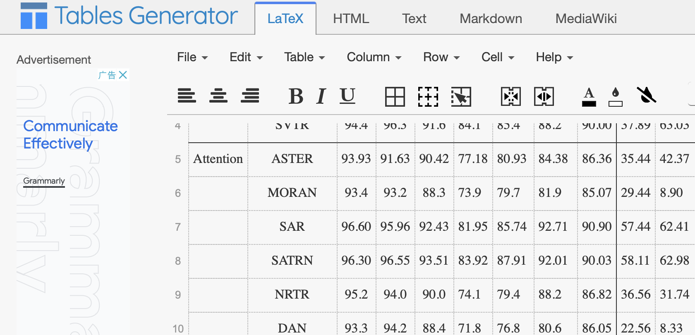

# Efficient Writting

## 1. Overleaf: Online LaTeX Editor

<div align=center>
  
</div>

- **Website**: [https://www.overleaf.com/](https://www.overleaf.com/)
- Overleaf is an online LaTeX editor that allows you to write and edit LaTeX documents online. It is a great tool for writing LaTeX documents. You can also share your documents with others and collaborate with them in real time. It is free to use and you can also upgrade to a paid plan if you need more features.

## 2. Python Graph Gallery: A gallery of Python graphs

<div align=center>
  
  
</div>

- **Website**: [https://python-graph-gallery.com/](https://python-graph-gallery.com/)
- Need guidance on how to make a specific graph in Python? This website is a great resource for you. It provides a gallery of Python graphs and you can find the code for each graph. It also provides a tutorial on how to make each graph.

## 3. I Love PDF: Online PDF Tools

<div align=center>
  
</div>

- **Website**: [https://www.ilovepdf.com/](https://www.ilovepdf.com/)
- When wrting latex paper, you may need pdf format image to insert into your paper. This website provides a lot of online pdf tools. You can use it to convert pdf to word, excel, ppt, image, etc. You can also use it to merge, split, compress, unlock, rotate, etc. It is a great tool for academic writting.

## 4. Color Hunt: Color Palettes for Designers and Artists

<div align=center>
  
</div>

- **Website**: [https://colorhunt.co/](https://colorhunt.co/)
- If you want your paper to be attractive enough, then your paper's color scheme is important. This website provides a lot of color palettes for you to choose from. You can also search for specific color palettes.

## 5. Tables Generator: Create LaTeX Tables


<div align=center>
  
</div>

- **Website**: [https://www.tablesgenerator.com/](https://www.tablesgenerator.com/)
- Tables are an important part of your paper. This website provides a tool for you to generate LaTeX tables. You can also use it to generate tables in other formats, such as HTML, Markdown, etc.

## 6. ACRONYMIFY: Name your paper with a cool acronyms

- **Website**:[http://acronymify.com/](http://acronymify.com/)
- A good paper naming not only motivates the reader to read, but also makes your paper memorable, for example by using abbreviations of words to construct an interesting word. A typical example is the Sesame Street Family in NLP (BERT, ELMO, ERNIE ...). [Acronymify](http://acronymify.com/search?q=Efficient+Deep+Learning) can automatically generate a series of acronyms for the title of your paper, and you pick the one you like

<div align=center>
  
</div>

## 7. Linggle: Grammer checker
- **Website**: [https://linggle.com/](https://linggle.com/)
- When you are writing in English, have you ever encountered these similar problems:
  * `in the afternoon`, `at the afternoon`, which one is correct?
  * The preposition after `present a method` is `for` or `to`.
  * What can be the verb before `war`?
  * What nouns can be used after `execute`
  * I just made up an expression `avoid his coming`, trying to determine if it was authentic.
- Let's see how linggle can help you with it
#### Search for the correct preposition pairing

- **Use / to space out the prepositions**:

<div align=center>
  
</div>

<div align=center>
  
</div>

- Linggle can look up the usage of relevant prepositions in its corpus and tell you which ones are most commonly used, and will give you many examples

#### What can be the verb before `war`?
- **We can use `v. a war` to query.**, `v. a war` means verb ahead war.

<div align=center>
  
</div>

<div align=center>
  
</div>

#### What nouns can be used after `execute`?
- **`excute n.`**

<div align=center>
  
</div>

#### Check the usage for authenticity

<div align=center>
  
</div>

- Saddly, `avoid his coming` is not authentic.

- **Linggle can do much more than those, and you can see more usages on its website.**

## 8. arXiv latex cleaner: Clean up the latex code of your paper
- [repo](https://github.com/google-research/arxiv-latex-cleaner)
- This tool allows you to easily clean the LaTeX code of your paper to submit to arXiv. From a folder containing all your code, e.g. /path/to/latex/, it creates a new folder /path/to/latex_arXiv/, that is ready to ZIP and upload to arXiv.

## 9. Usefull prompt for ChatGPT to beautify your paper
- Here is a commonly used prompt for ChatGPT, which can beautify your paper.
```
I want you to act as an English translator, spelling corrector and improver. I will speak to you in any language and you will detect the language, translate it and answer in the corrected and improved version of my text, in English. I want you to replace my simplified A0-level words and sentences with more beautiful and elegant, upper level English words and sentences. Keep the meaning same, but make them more literary. I want you to only reply the correction, the improvements and nothing else, do not write explanations. My first sentence is "istanbulu cok seviyom burada olmak cok guzel"
```