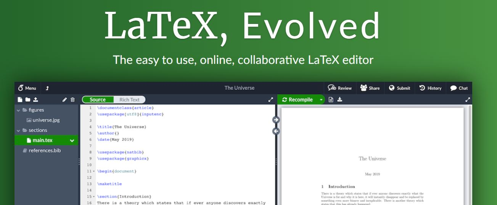
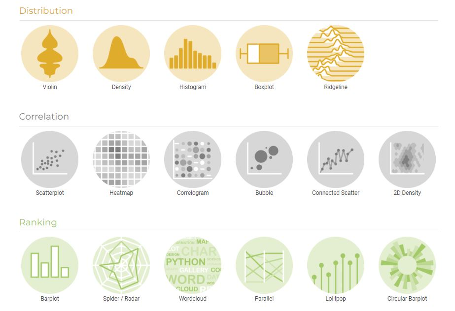
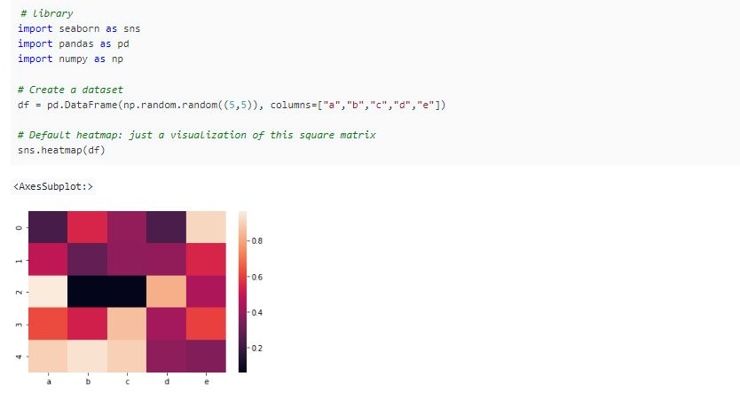
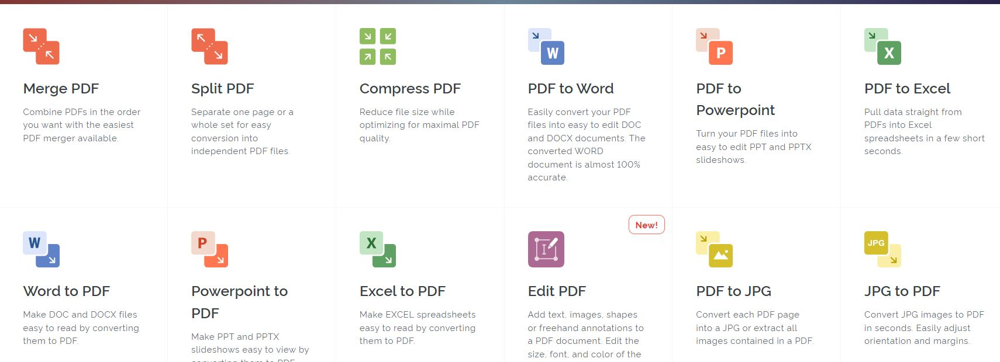
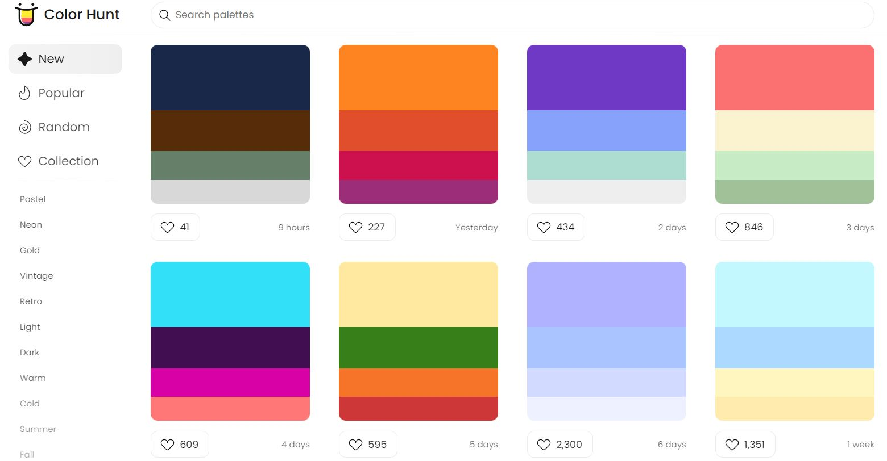

# Efficient Writting

## 1. Overleaf: Online LaTeX Editor

  

- **Website**: [https://www.overleaf.com/](https://www.overleaf.com/)
- Overleaf is an online LaTeX editor that allows you to write and edit LaTeX documents online. It is a great tool for writing LaTeX documents. You can also share your documents with others and collaborate with them in real time. It is free to use and you can also upgrade to a paid plan if you need more features.

## 2. Python Graph Gallery: A gallery of Python graphs

  
  

- **Website**: [https://python-graph-gallery.com/](https://python-graph-gallery.com/)
- Need guidance on how to make a specific graph in Python? This website is a great resource for you. It provides a gallery of Python graphs and you can find the code for each graph. It also provides a tutorial on how to make each graph.

## 3. I Love PDF: Online PDF Tools

  

- **Website**: [https://www.ilovepdf.com/](https://www.ilovepdf.com/)
- When wrting latex paper, you may need pdf format image to insert into your paper. This website provides a lot of online pdf tools. You can use it to convert pdf to word, excel, ppt, image, etc. You can also use it to merge, split, compress, unlock, rotate, etc. It is a great tool for academic writting.

## 4. Color Hunt: Color Palettes for Designers and Artists

  

- **Website**: [https://colorhunt.co/](https://colorhunt.co/)
- If you want your paper to be attractive enough, then your paper's color scheme is important. This website provides a lot of color palettes for you to choose from. You can also search for specific color palettes.