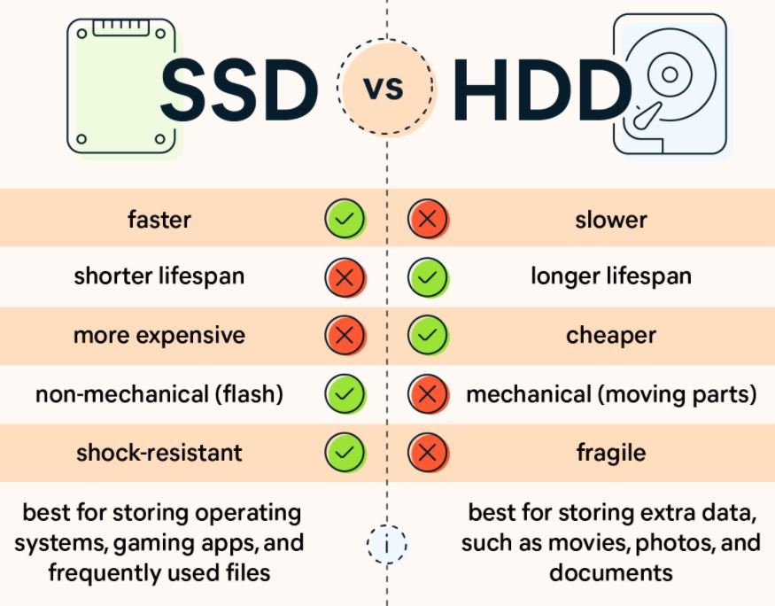

# Speed up data loading
## 1. Use SSD instead
<div align=center>

</div>

- Training a neural network today often requires massive data, which requires a lot of pointer lookups and reads to the disk. The read and query of HDD is very slow which may become the bottleneck of data processing. Using an SSD can solve this problem quickly. I once did an experiment where it would take two to three days to train a text recognizer with an HDD reading 13 million images, but it only took 4 hours to use an SSD. You don't necessarily need a good GPU, but you definitely need an SSD.

## 2. Faster Data preprocessing
- Data preprocessing is very important in deep learning and speeding up the preprocessing process can save you a lot of time. In the following chapters, I will introduce you to some basic methods, including efficient data storage methods, data preprocessing on the GPU, and libraries to accelerate data preprocessing.
### 2.1. Efficient data storage methods
### 2.2. Efficient data augmentation tool
- Deep neural networks require a lot of training data to obtain good results and prevent overfitting. Image augmentation is a process of creating new training examples from the existing ones.
- [torchvision.transforms](https://pytorch.org/vision/stable/transforms.html) library provides many methods for data augmentation and is widely used. But if your training speed is limited by data augmentation, then you should give [Albumentations](https://github.com/albumentations-team/albumentations) a try.
<div align=center>

</div>

- [Albumentations](https://github.com/albumentations-team/albumentations) is a Python library for image augmentation. It has many advantages and can even be applied to object detection and segmentation. One point we want to focus on here is that it is very fast.
- Here is an experiment to compare the speed of `torchvision.transforms` and `albumentations`
    * **Platform**: Google Colab
    * **Experiment Setup**: We randomly selected **9469 images from ImageNet** and used these two methods for the same data augmentation when loading the data, and counted the time required to traverse the entire data set.
    * **Pseudo-code**:
        ```python
        import time
        from torch.utils.data import DataLoader
        import albumentations as A
        import torchvision.transforms as T
        # use the same augmentation strategy
        transform_albumentations = A.Compose([
            A.Resize(width=384,height=384),
            A.RandomCrop(width=256,height=256),
            A.HorizontalFlip(p=0.5),
            A.RandomBrightnessContrast(p=0.2),
        ])
        # use the same augmentation strategy
        transform_torchvision = T.Compose([
            T.ToPILImage(), # torchvison.transforms take picture in PIL form
            T.Resize(width=384,height=384),
            T.RandomCrop(width=256,height=256),
            T.HorizontalFlip(p=0.5),
            T.RandomBrightnessContrast(p=0.2),
        ])

        transforms = {'albumentations':transform_albumentations,
                'torchvision':transform_torchvision}

        for name, transform in transforms.items():
            dataset = CustomDataset(dataset, transform)
            loader = DataLoader(dataset,batch_size=256,num_workers=2)

            start_time = time.time()
            for batch in loader:
                # only forward
                continue
            cost_time = time.time() - start_time
            print('{} cost time: {}'.format(name,cost_time))
        ```
    * **Results**
      **BS stands for batch size, NW stands for num_workers in dataloader.**
      | Loader Params | Albumentations Time (s) | Torchvision Time (s) | A / T  |
      | ------------- | ----------------------- | -------------------- | ------ |
      | BS=1, NW=1    | 92.40                   | 137.51               | 67%    |
      | BS=2, NW=1    | 86.51                   | 124.77               | 69.34% |
      | BS=32, NW=1   | 81.40                   | 119.75               | 67.97% |
      | BS=128, NW=1  | 78.49                   | 111.60               | 70.33% |
      | BS=256, NW=1  | 78.16                   | 106.83               | 70.33% | 73.16% |
      | BS=128, NW=2  | 64.92                   | 86.33                | 70.33% | 75.20% |
      | BS=256, NW=2  | 64.89                   | 88.26                | 70.33% | 73.52% |
- As you can see from the table above, using `Albumentations` will save you an average of 30% of your time under different experimental settings.
