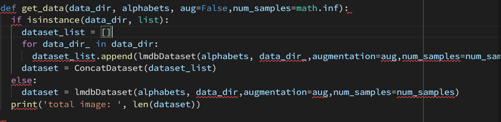
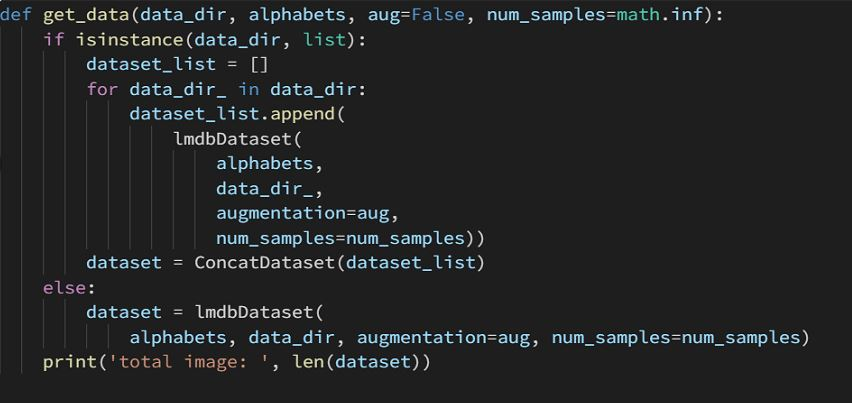
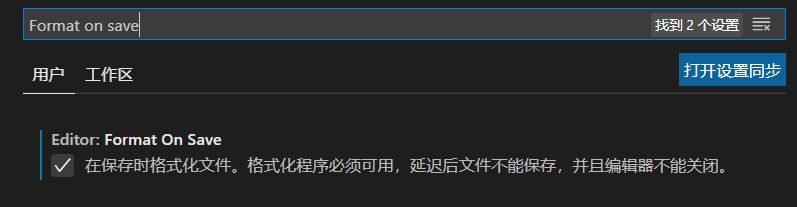
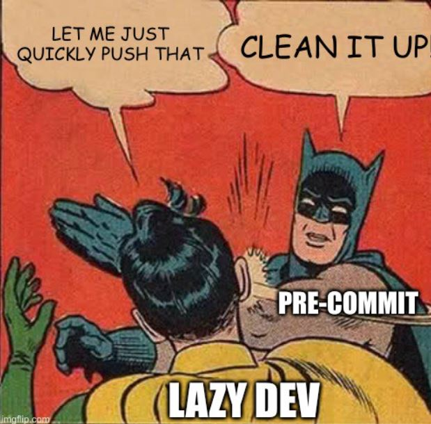
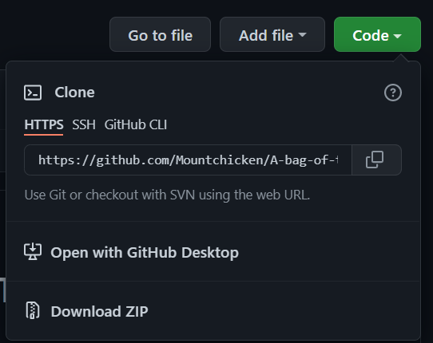
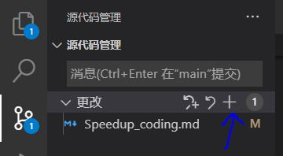
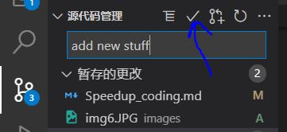

# 1. You shouldn't miss VSCode
- <center>

- **You can pass this section if you are already using VSCode. Please allow me to spend some time convincing those are not**
- Without doubt, VSCode is the **most popular** code editor by combining ease of use and popular IDE features.
- As a loyal user of VSCode, let me put some fancy features in VSCode that help me a lot in my deep learning life.
  * **Extremely fast** lanuncing speed, just in a second
  * **Freedom of customization.** If you don’t like so much the basic design proposed by default, you can create your own customized themes with a high flexibility that lets you customize nearly all UI elements of the editor.If you don’t have the time to create one by yourself, you can choose a theme from the thousands available on the market, many of them are very nice.
  * **Well support to Git.** Git is a commonly used develop tools and even if you are not familiar with git, you can still mannage to use it with the user-friendly operations provided in VSCode.
  * **World's best market.** There are literally thousands of extensions in the VS Code marketplace with new ones coming seemingly every single day.
- Talking is useless and you will find it out when you tried. [microsoft/vscode](https://github.com/microsoft/vscode)

# 2. Automatically format your code.
- Using `yapf` and `flake8` to automatically format your code will save you plenty of time.
  * before format:
  
  * after format
  
- Install on VSCode:
  * `Step1`, install yapf and flake8
    ```bash
    $ pip install flake8 yapf isort==5.10.1
    ```
  * `Step2`, add the following commands in `settings.json`
    ```json
    {
      "python.linting.flake8Enabled": true,
      "python.linting.pylintEnabled": false,
      "python.formatting.provider": "yapf",
      "python.formatting.yapfArgs": [
          "--style",
          "{based_on_style: pep8, BLANK_LINE_BEFORE_NESTED_CLASS_OR_DEF: true, SPLIT_BEFORE_EXPRESSION_AFTER_OPENING_PAREN: true}"
      ],
      "editor.formatOnSave": true,
      "editor.formatOnPaste": true,
      "python.linting.enabled": true,
      "editor.rulers": [
          80,
          120
      ],
      "[python]": {
          "editor.codeActionsOnSave": {
              "source.organizeImports": true
          }
      }
    }
    ```
  * `Step3`, search `Format on save` in settings and choose it.
  

# 3. Using pre-commit hook to check your code.
- <center>
- pre-commit hooks are a mechanism of the version control system git. They let you execute code right before the commit. Git hook scripts are useful for identifying simple issues before submission to code review. The hooks can automatically point out issues in code such as missing semicolons, trailing whitespace, and debug statements.
- Install Guide
  * `Step1`: Install pre-commit
    ```bash
    $ pip install -U pre-commit
    ```
  * `Step2`: Add `.pre-commit-config.yaml`.I have provided you with a hook that is used in MMOCR. Add this `.yaml` file to your repository folder,

  * `Step3`: Initialize in your repository folder(This step needs to repeat ever ytime you create a new repo)
    ```bash
    $ pre-commit install
    ```
- After installed, you can run the following command to start a check.
  ```bash
  $ pre-commit run --all-files
  ```
- Also, when you are committing your code, the hook will automatically check your code and you won't be able to successfully commit it until all check passed. Yeah, that's the BATMAN🦇.

# 4. Learn to use Git
- Combine Git, VSCode, and Github can largely advance your coding progress.
- Git is complecate, however, with VSCode, it's still complecate.😅 But don't worry, here are some basic steps that is well enough for your personal repo.
  - `Step1`: Setup git config which is your name and email address
    ```bash
    # username and email should be consistent with your github count, E.g.
    # $ git config --global user.name "Mountchicken"
    # $ git config --global user.email "mountchicken@outlook.com"
    $ git config --global user.name "Username"
    $ git config --global user.email "Email"
    ```
  - `Step2`: Create a New repository on you github
  - `Step3`: Clone your repo. Copy the https link in the green button
  
    ```bash
    $ git clone https://github.com/...
    ```

- After finish cloning, you will find a hidden file named `.git` in your folder.That's where all the git information stored.
- Now, here are the recommond procedure when you are developing.
  - `Step1 (Optional)`: Copy the `.pre-commit-config.yaml` to your folder.
  - `Step2 (Optional)`: Install pre-commit hook
    ```bash
    $ pre-commit install
    ```
  - `Step3`: Just code as usual
  - `Step3`: Commit your code
    * When you add some code, you will see the modified files are highlighted. Press button `+` to add those modification
    
    * Then press button `√` to commit.
    
